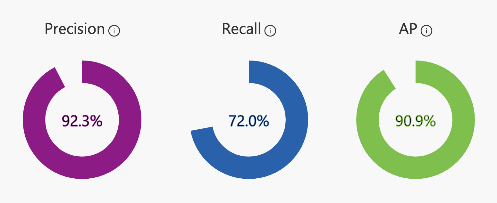

# azure-proj2
Project 2 for Microsoft Azure on WUT

## Table of contents
* [Team](#the-team)
* [Tematyka projektu](#tematyka-projektu)
* [Architektura](#architektura)
* [Rozwiązanie](#rozwiązanie)
* [Demo dzałania](#demo-działania)

## The Team
* Krzysztof Maciejewski - https://github.com/kristoph4822
* Marcin Kotecki  - https://github.com/marcinkotecki
* Hubert Kunikowski - https://github.com/qunikowski
* Danuta Stawiarz  - https://github.com/DanutaStawiarz

## Tematyka projektu
W czasach niedoboru żywności na świecie niezwykle istotnym zagadnieniem okazuje się poszukiwanie sposobów, dzieki którym produkcja jedzenia stanie się bardziej wydajna. Obecnie, w niektórych regionach świata straty spowodowane chorobami roślin sięgają nawet 100%.

Aplikacja ma na celu wsparcie rolników -  umożliwia zeskanowanie zdjęcia liścia w celu postawienia diagnozy. W wyniku użytkownik otrzymuje gatunek rośliny, z jakiej pochodzi liść, a także diagnozę, czy roślina jest zdrowa lub jaką z chorób posiada. Obecnie w aplikacja umożliwia diagnostykę dla:
* jabłek - liść zdrowy/ apple scab( parch jabłoni)/ apple black rot (czarna zgnilizna)/ cedar apple rust
* kukurydzy - liść zdrowy/ corn common rust (rdza zwykła) / gray leaf spot (szara plamistość liści)/ northern leaf blight
* pomidor - liść zdrowy/ late blight/ leaf mold/ septoria leaf spot/ two-spotted spider mite/ mosaic virus/ target spot/ yellow curl virus

W przyszłości możliwe jest rozszerzenie zakresu funckjonowania aplikacji o kolejne gatunki oraz choroby.

## Architektura
Aplikacja korzysta z serwisów oferowanych w całości przez platformę Azure. Schemat działania przedstawia się następująco:

## Funkcjonalności
* Rozpoznawanie chorób roślin na podstawie wprowadzonych zdjęć
* Zapisywanie zwracanych predykcji w bazie danych
* Analizowanie chorób roślin w zwracanych przez aplikację predykcjach
* Prezentowanie panujących tendencji dotyczących chorób roślin

## Technologie
W projekcie wykorzystane zostały nastepujące technologie:
- Azure Custom Vision
- Azure Postgresql
- Azure Web App
- Azure Key Vault

## Opis rozwiązania

### 1. Stworzenie modelu
Do wytrenowania modelu wykorzystano serwis Custom Vision. W obrębie serwisu zostały umieszczone zdjęcia liści zdrowych oraz z różnymi chorobami. W ramach zbioru trenującego zostało wykorzystanych 200 zdjęć każdego rodzaju liścia oraz choroby. Dane te pochodziły z https://www.kaggle.com/vipoooool/new-plant-diseases-dataset. Następnie model został wytrenowany. Wyniki można uznać za zadowalające, co potwierdziły wykonywane na zbiorze testowym doświadczenia. Wyniki modelu przedstawiają się następująco:

### 2. Stworzenie aplikacji webowej
Do stworzenia aplikacji webowej wykorzystano Pythonowego frameworka Flask. Aplikacja umożliwia wgranie własnego zdjęcia i zwrócenie dla niego wyników predykcji. Dostępna jest również karta ze statystykami, gdzie widnieją najpopularniejsze wyniki z ostatniego tygodnia. Z aplikacją powiązana jest baza danych. Aplikacja dostepna jest w Azure App Service pod adresem: //LINK

### 3. Stworzenie bazy danych
Baza danych stworzona została w Azure Postgresql. W bazie przechowywane są wgrane zdjęcie, wynik predyckji oraz data. Dane te wykorzystywane są do pokazywania statystyk w aplikacji w zakładce Statistics. 

### 4. Wizualizacja wyników
Projekt zakładał podpięcie Power BI do bazy danych, jednak napotkano problem - konta studenckie nie mogły zostać zarejestrowane:
 
    Twój dział IT wyłączył rejestrację dla produktu Microsoft Power BI. Skontaktuj się z nim, aby ukończyć rejestrację.
    
W związku z tym zdecydowano się zamiast tego zrobić podsumowanie w dodatkowej zakładce w aplikacji webowej.

### 5. Przechowywanie sekretów
Bezpieczne przechowywanie sekretów, kluczów dostępowych do bazy danych, zostało zapewnione dzięki wykorzystaniu Azure Key Vault. Jest to usługa chmurowa, zapewnia bezpieczne przechowywanie i łatwy dostęp do sekretów, do ktorych dostęp chcemy kontrolować. 

## Demo działania

Demo działania aplikacji - >LINK<
