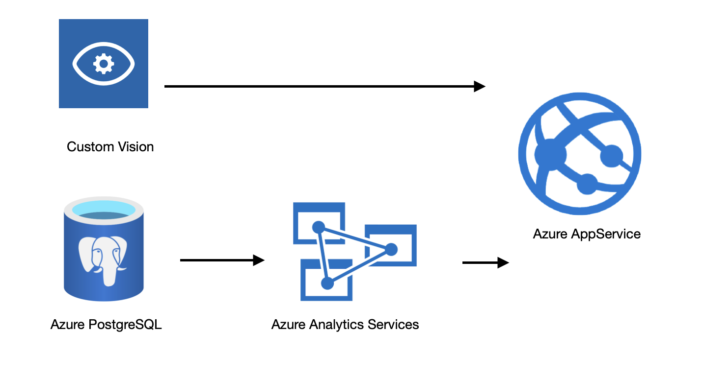

# azure-proj2
Project 2 for Microsoft Azure on WUT

## Table of contents
* [Team](#the-team)
* [Tematyka projektu](#tematyka-projektu)
* [Architektura](#architektura)
* [Rozwiązanie](#rozwiązanie)
* [Demo dzałania](#demo-działania)

## The Team
* Krzysztof Maciejewski - https://github.com/kristoph4822
* Marcin Kotecki  - https://github.com/marcinkotecki
* Hubert Kunikowski - https://github.com/qunikowski
* Danuta Stawiarz  - https://github.com/DanutaStawiarz

## Tematyka projektu
Celem projektu było stworzenie aplikacji webowej skierowanej do rolników, która na podstawie wprowadzanych przez użytkownika zdjęć roślin, rozpoznaje choroby, na które te rośliny mogą cierpieć. Dodatkowo, na podstawie wprowadzanych przez użytkowników zdjęć, wyznaczane są aktualnie panujące trendy dotyczące wyszukiwanych chorób, dzięki czemu użytkownicy mogą ustrzec się przed chorobami roślin, które są aktualnie powszechne. Projekt zakładał wykorzystanie i przetestowania działania komponentów platformy Azure - Azure Custom Vision oraz Azure Analytics. Azure Postgresql, Azure Web App oraz udostępnienie programu potencjalnemu klientowi.

## Funkcjonalności
* Rozpoznawanie chorób roślin na podstawie wprowadzonych zdjęć
* Zapisywanie zwracanych predykcji w bazie danych
* Analizowanie chorób roślin w zwracanych przez aplikację predykcjach
* Prezentowanie panujących tendencji dotyczących chorób roślin

## Architektura
Schemat działania przedstawiony został w formie graficznej poniżej:

## Technologie
W projekcie wykorzystane zostały nastepujące technologie:
- Azure Custom Vision
- Azure Postgresql
- Azure Analitycs
- Azure Web App

## Opis rozwiązania

### 1. Stworzenie modelu
Model do rozpoznawania chorób roślin stworzony został przy wykorzystaniu serwisu Azure Custom Vision. Do trenowania użyto //źródłaDanych

### 2. Stworzenie aplikacji webowej
Do stworzenia aplikacji webowej wykorzystano Pythonowego frameworka Flask. Z aplikacją powiązana jest baza postgresql Aplikacja dostepna jest pod adresem: //LINK

### 3. Wykorzystanie Azure Analitycs

## Demo działania

Demo działania aplikacji - >LINK<

